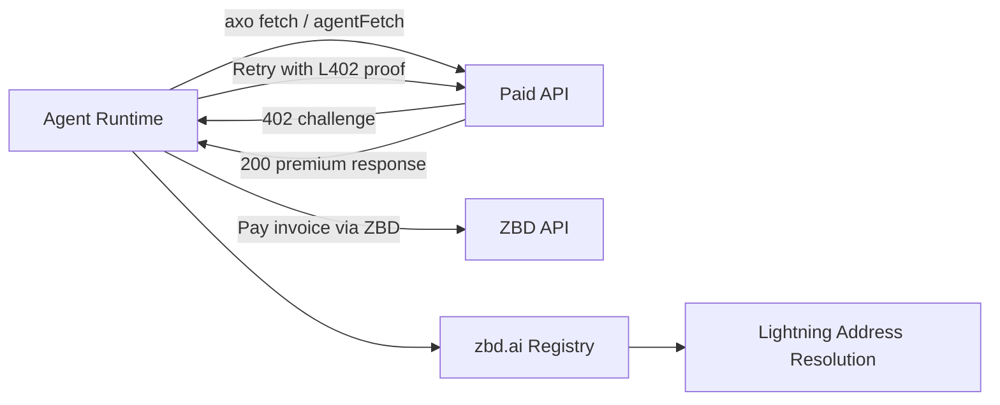

The ZBD Agents architecture is built around a simple split: `agent-pay` issues payment challenges, and `agent-fetch` or `axo fetch` solves them automatically.

## Components

<CardGroup cols={2}>
  <Card title="@axobot/cli" icon="wallet" href="/agents/axobot-cli">
    CLI interface (`axo`) for wallet operations, payment history, withdraw flows, and paid fetch.
  </Card>
  <Card title="@axobot/fetch" icon="bolt" href="/agents/axobot-fetch">
    Client-side L402 flow manager with cache reuse and max payment guardrails.
  </Card>
  <Card title="@axobot/pay" icon="lock" href="/agents/axobot-pay">
    Server middleware that returns 402 challenges and verifies payment proof.
  </Card>
  <Card title="zbd.ai Registry" icon="at" href="/agents/registry">
    Identity layer for stable Lightning addresses and LNURL resolution.
  </Card>
</CardGroup>

## Request Lifecycle

<Steps>
  <Step title="Client requests protected resource">
    A request hits an endpoint wrapped by `agent-pay`.
  </Step>
  <Step title="Server returns 402 challenge">
    `agent-pay` creates an invoice and returns `WWW-Authenticate: L402 ...` plus challenge JSON.
  </Step>
  <Step title="Client pays challenge">
    `agent-fetch` (or `axo fetch`) pays the invoice and retrieves the preimage.
  </Step>
  <Step title="Client retries with proof">
    The request is retried with `Authorization: L402 <macaroon>:<preimage>`.
  </Step>
  <Step title="Server verifies and allows">
    `agent-pay` validates signature, hash, amount, expiry, and settlement state before returning 200.
  </Step>
</Steps>

## Shared Local State

| Path | Primary Writer | Primary Reader |
|---|---|---|
| `~/.zbd-wallet/config.json` | `axo init` | `axo`, dashboard |
| `~/.zbd-wallet/payments.json` | `axo send/receive` | `axo`, dashboard |
| `~/.zbd-wallet/token-cache.json` | `axo fetch` | `axo fetch` |
| `~/.zbd-wallet/server-tokens.json` | `agent-pay` | `agent-pay` |

<Tip>
  The toolkit is optimized for Node.js 22+ across all core packages.
</Tip>
