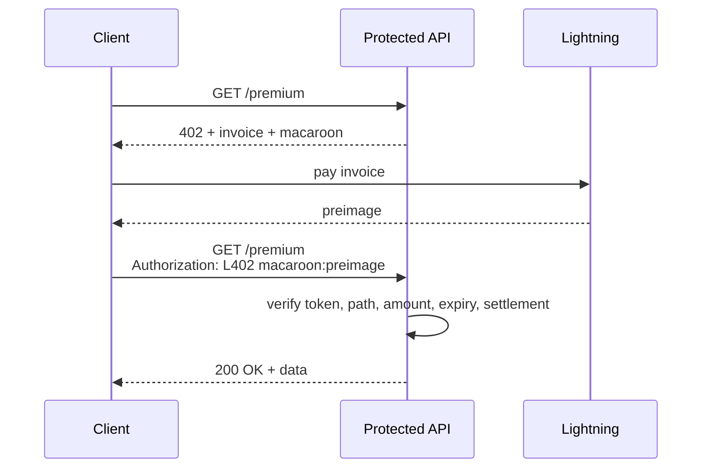

Gate any API route behind a Lightning payment. Clients request a resource, receive a `402` challenge, pay the invoice, then retry with an `Authorization` proof.

This section documents the ZBD implementation using:

- `@zbdpay/agent-pay` (server-side route protection)
- `@zbdpay/agent-fetch` (client-side challenge payment and retry)
- `@zbdpay/agent-wallet` (`zbdw fetch` for CLI-based paid requests)

<Info>
  The canonical scheme is `L402`. Legacy `LSAT` is still accepted for backwards compatibility.
</Info>

## How It Works



<Steps>
  <Step title="Client calls a protected endpoint without credentials" />
  <Step title="Server returns 402 with WWW-Authenticate and challenge JSON" />
  <Step title="Client pays invoice and receives a payment preimage" />
  <Step title="Client retries with Authorization: L402 &lt;macaroon&gt;:&lt;preimage&gt;" />
  <Step title="Server verifies proof and forwards request to your handler" />
</Steps>

## Wire Format

`agent-pay` returns a challenge header like:

```http
WWW-Authenticate: L402 macaroon="<token>", invoice="<bolt11>"
```

And a JSON body with these fields:

```json
{
  "error": {
    "code": "payment_required",
    "message": "Payment required"
  },
  "macaroon": "<token>",
  "invoice": "<bolt11>",
  "paymentHash": "<hash>",
  "amountSats": 21,
  "expiresAt": 1735766400
}
```

## What To Read Next

<CardGroup cols={2}>
  <Card title="Setup" icon="plug" href="/agents/l402-setup">
    Install packages, configure environment variables, and run a local paid-route demo.
  </Card>
  <Card title="Protect Routes" icon="server" href="/agents/l402-server">
    Add payment gates to Express, Hono, and Next.js with `@zbdpay/agent-pay`.
  </Card>
  <Card title="Call Paid APIs" icon="bolt" href="/agents/l402-client">
    Use `agentFetch` or `zbdw fetch` to solve 402 challenges automatically.
  </Card>
  <Card title="Error Reference" icon="circle-exclamation" href="/agents/l402-errors">
    Understand every L402-related error code returned by the middleware.
  </Card>
</CardGroup>
