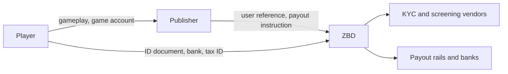

ZBD collects and stores the sensitive data that payments require, so your game doesn't have to. Identity documents, tax identifiers and bank details go from the player straight to ZBD and never pass through your systems. This page explains who is responsible for which data, how to process a player's request to access or erase their data, and the practices we recommend for keeping your own footprint small.
It does not cover the data you collect in your own game — player accounts, gameplay, telemetry, marketing — which remains yours to govern. It is operational guidance, not legal advice; your own DPA with ZBD and your privacy notice take precedence where they differ.
## Roles under GDPR
Two relationships apply, depending on the data.
**ZBD as an independent controller.** For identity verification, sanctions screening, AML monitoring, tax reporting and fraud prevention, ZBD acts under its own legal obligations as a regulated payments provider. ZBD decides what is collected, how long it is kept and when it must be disclosed to authorities. You do not instruct ZBD on this data and you are not responsible for it.
**ZBD as your processor.** For payment and payout operations you initiate through the API, such as creating embedded accounts, allocating funds and paying out players, ZBD processes personal data on your behalf under the DPA.
**You as controller.** You remain the controller for your players' game accounts, gameplay data, and anything you send to ZBD in API fields such as `metadata`.
What this means in practice:
- Your compliance scope excludes identity documents, tax identifiers and bank details, because you never receive them.
- You still need a lawful basis and a privacy notice for the player data you hold, and your notice must tell players that a payments provider verifies their identity and processes their payouts.
- A player privacy request may need action from both of us. The sections below explain how to route it.
## Who controls what
ZBD is an independent controller for the identity, tax and banking data it collects, not your processor for it. We decide what to collect in order to meet our own KYC, AML, sanctions and tax obligations, and we cannot stop collecting it on your instruction. That is precisely why the data stays out of your scope: it never becomes yours to control.
You remain controller for everything on your side of the line, including game accounts, gameplay and earnings history, your own support records, and the reference you pass us to identify a payee.



| Data | Controller | Why |
| --- | --- | --- |
| Player account, progress, telemetry, marketing in your game | Publisher | You decide why it exists and how long you keep it |
| Identifiers you send to create a ZBD user | Publisher at source, ZBD once received | You choose to send them; ZBD then uses them under its own obligations |
| Name, date of birth, address, nationality, identity documents | ZBD | Customer due diligence obligations sit on ZBD as the regulated entity |
| Tax identifiers and tax reporting records | ZBD | Statutory reporting, including DAC8 and US information reporting |
| Bank accounts, IBANs and other payout instruments | ZBD | Needed to execute the payout and to meet payment-services rules |
| Sanctions, watchlist and PEP screening results, risk ratings | ZBD | Screening is a legal obligation and its output cannot be shared back |
| Transactions, balances and ledger entries | ZBD | Record-keeping obligations with fixed statutory retention |
| Device attestation and anti-farming signals | ZBD | Fraud prevention across the ZBD platform |

The practical consequence: a player asking you to delete their data can have their game account removed by you, but the regulated records behind their payouts are governed by ZBD's retention rules, not yours.
## Submit an erasure request
Use this when a player asks you to delete their data and you want ZBD to remove the data it holds for them in your systems.
1. Send a POST `/api/v1/data-protection/erasure-requests` request.

| Parameter | In | Required | Description |
| --- | --- | --- | --- |
| `user_id` | path | Yes | The ZBD user ID of the player's embedded account |
| `idempotency_key` | body | Yes | Your key for this request. Retries with the same key return the original request |
| `case_reference` | body | No | Your own ticket or case ID. Do not put personal data here |

```json
{
  "idempotency_key": "erasure-10482",
  "case_reference": "privacy-ticket-10482"
}
```
2. On success the API returns `202 Accepted` and the erasure request.
```json
{
  "success": true,
  "data": {
    "erasure_request_id": "f81d4fae-7dec-11d0-a765-00a0c91e6bf6",
    "status": "PENDING",
    "requested_at": "2026-09-20T14:22:31Z"
  },
  "error": null
}
```
`status` values: `PENDING`, `COMPLETED`, `FAILED`.
If an erasure request already exists for this user, the endpoint returns it with its current status instead of creating a second one.
Failures return `success: false` with an `error.code`:

| HTTP | `error.code` | What to do |
| --- | --- | --- |
| `404` | `USER_NOT_FOUND` | The user ID doesn't exist |
| `409` | `OPEN_BALANCE` | The account still holds funds or has a payout in progress. Pay out or return the balance, then submit again |

Wait for the `erasure_request.completed` webhook. After this, the account is closed, personal fields show as *REDACTED* in the dev portal, and the redaction date is recorded on the account.
```json
{
  "event_id": "3b1e...",
  "event_type": "erasure_request.completed",
  "erasure_request_id": "f81d4fae-7dec-11d0-a765-00a0c91e6bf6",
  "user_reference_id": "player-10482",
  "status": "completed",
  "occurred_at": "2026-09-20T14:31:02Z"
}
```
### What is deleted and what is kept
- **Deleted**: the player's profile in your systems, contact details, payout preferences, and the link between your player ID and ZBD's records.
- **Redacted**: personal fields on transaction and payout records. Amounts, dates and IDs remain, so your ledger and reconciliation stay intact.
- **Restricted, not deleted**: records ZBD must keep by law, such as verification evidence, screening results, AML records and tax reporting data. GDPR Art. 17(3)(b) exempts data held under a legal obligation. These records are locked from normal use, are not visible to you, and are deleted when the legal retention period ends.
## Retention

| Data | Kept for |
| --- | --- |
| Verification evidence, screening and AML records | The period required by anti-money-laundering law, typically five years after the relationship ends, depending on jurisdiction |
| Tax identifiers and tax reporting data | The period required by tax law in the reporting jurisdiction |
| Transaction and payout records | The period required by financial record-keeping law |

You cannot shorten the legally required periods, and you don't need to track them. ZBD deletes the data when each period ends.
## Best practices
**Keep sensitive data out of your systems**
- Always send players to ZBD's hosted flows for identity, tax and bank details. Never collect these in your own forms, even to "pre-fill".
- Don't ask players to send documents to your support team. Direct them to the hosted flow.
- Don't take screenshots or copies of masked bank details into support tickets.
**Send ZBD only what it needs**
- Use your internal player ID as the reference. Don't use an email address, real name or phone number as an identifier.
- Keep personal data out of `metadata`, `reference` and description fields. These appear in reports, logs and exports.
- Don't log full API responses or webhook payloads that contain player contact details.
**Control access on your side**
- Give each person their own dev portal login with the narrowest role that fits. See [Account structure](/business-operations/publisher-account-types).
- Use the Support Agent role for customer support. Personal fields are masked for it by default.
- Remove access on the day someone leaves, and set expiry dates for external contractors.
**Run privacy requests as a process**
- Name one owner for privacy requests and record each request with a ticket ID. Pass that ID as `reference`.
- Verify the requester is the account holder before you act. Use an in-game or logged-in channel, not email alone.
- Delete your own data and submit the ZBD erasure request in the same workflow, so neither side is forgotten.
- Check for an open balance before you promise a deletion date.
## Other privacy laws
The model on this page follows GDPR, and the same split of responsibilities applies under UK GDPR. For other regimes, including CCPA/CPRA in California and LGPD in Brazil, the erasure and access flows work the same way. Legal retention exemptions exist in each of them, and the periods differ by jurisdiction.
