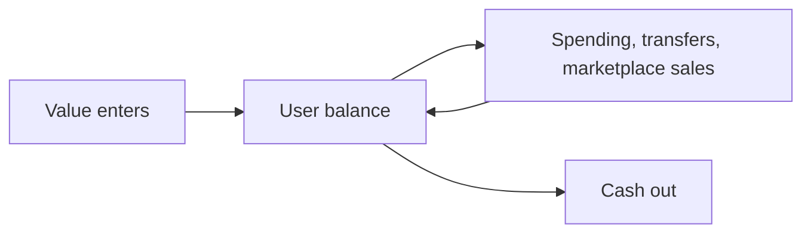

Give players a balance inside your game they can earn into, spend, send to each other and cash out. ZBD holds the accounts, the ledger and the money movement, so you build the economy rather than the financial infrastructure underneath it.
## What it's for
- Game economies running on your own currency
- Player-to-player trading and marketplaces
- Creator and mod marketplaces with revenue splits
- Rewards that become spendable rather than only redeemable
## How it works

1. [**Create users**](/embedded-accounts/accounts-and-balances)**.** A user is the person holding a balance. You create them from your backend using your own identifier for that player.
2. [**Credit their balance**](/embedded-accounts/credits)**.** Either you're giving value out, or a player has bought currency through a platform store and you credit them what that purchase is worth.
3. [**Players spend, send and trade**](/embedded-accounts/spending)**.** In-game purchases, transfers between players, and marketplace sales with revenue split between the parties.
4. [**Players cash out**](/embedded-accounts/cash-out)**.** A balance converts to real money and settles to a bank account or other payout account the player links.
## One ledger, two kinds of currency
The same ledger holds real-world fiat and any virtual currency you define, so an economy can run on either or on both at once, and a player can hold several balances side by side.
The two aren't interchangeable. A currency you define carries properties money doesn't, starting with the fact that you issue it, you set what it's worth in each direction, and you decide whether it converts back to money at all.
[Currencies](/embedded-accounts/currencies) covers what you define up front and what's hard to change afterward.
## Buying through a platform store
When a player buys currency through a platform store, the store settles to you on its own cycle. ZBD credits the player's balance immediately against a wallet you've pre-funded, so the player has their currency at the moment they pay rather than waiting on settlement.
## Is this the right fit
Embedded Accounts suits an economy where value lives inside your game and moves in more than one direction. Two signals point at it:
- Players hold a balance they earn into, spend from and top up, rather than one that only accumulates until it's withdrawn.
- You would rather ZBD hold the ledger than build and reconcile one yourself.
Studios with a mature ledger already running usually keep it. If players only ever accumulate and withdraw, [Embedded Payouts](/embedded-payouts) is the simpler fit.
## What ZBD handles
- Accounts, balances and the ledger
- Currency definition and conversion
- Identity verification and tiering
- Sanctions and watchlist screening
- Cash out rails, FX and settlement
## Start here
[Accounts and balances](/embedded-accounts/accounts-and-balances) · [Currencies](/embedded-accounts/currencies) · [Credits](/embedded-accounts/credits) · [Cash out](/embedded-accounts/cash-out)
