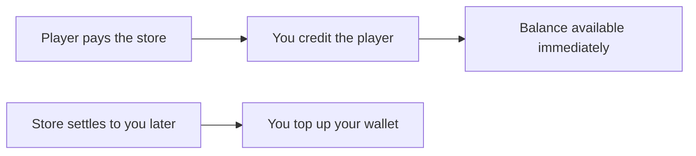

A credit puts value into a player's balance. It's the same call whatever the reason behind it.
## Crediting a player
A credit takes the player, the currency and the amount. The value is spendable immediately.
Send an idempotency key with every credit, so a retry on your side doesn't hand a player twice what you meant to give them.
## Why you'd credit
Most credits fall into two situations.
**Value you're giving out.** Rewards for play, tournament prizes, compensation after an outage, promotional grants, anything you decide a player should have.
**Covering a purchase made elsewhere.** A player buys currency through a platform store, and you credit them the amount that purchase entitles them to.
## Covering a platform store purchase
When a player pays a platform store (e.g. Steam, Meta), you decide what that purchase is worth in your currency and credit them that amount.

The player has their currency the moment they pay. The store settles to you on its own cycle, which can run to weeks, so your wallet carries the gap in between.
We recommend sizing your funding against how much players buy over a full settlement period, since a single day's volume will leave you short.
## What a credit carries
Every credit lands with a source tag recording how the player came by it, and that tag decides what they can do with it afterward. Value you gave out and value a player paid for are treated differently for exactly this reason.
[Currencies](/embedded-accounts/currencies) covers the tags and what each one permits. ZBD sets that, not you.
