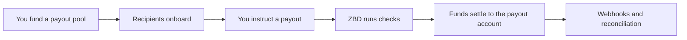

Pay creators, sellers and players in the countries ZBD supports, from a pool you fund and control. ZBD handles identity verification, screening, tax collection and the payment rails, and the sensitive data those steps involve never touches your systems.
## What it's for
- Creator and UGC revenue share
- Marketplace seller payouts
- Tournament and prize distribution
- Player reward cash out
## How it works

1. [**Fund a pool**](/embedded-payouts/funding)**.** Pre-fund a payout pool in your funding currency. Set a top-up threshold so it refills before it runs dry.
2. [**Onboard users**](/embedded-payouts/users)**.** Create the user from your backend, then hand off to ZBD for identity verification, tax information and linking a payout account. Verification is tiered, and when you collect it is your call: up front for a known set of users, or at the point a payout requires it.
3. [**Instruct a payout**](/embedded-payouts/paying-out)**.** On demand, per user. Either your ledger is the source of truth and ZBD holds no balance for your users, or ZBD holds each user's balance for you. Both are supported, and [How payouts work](/embedded-payouts/how-payouts-work) explains how to choose.
4. **ZBD runs the checks.** Identity, sanctions and watchlist screening, and payout limits.
5. [**Funds settle**](/embedded-payouts/methods-and-coverage)**.** The user is paid in their own currency, into the payout account they linked.
6. **Reconcile.** Payout lifecycle events arrive by webhook, so you can keep your own records in step.
## Choosing your integration
Your backend handles creating users, crediting balance, issuing payout instructions and handling webhooks in every case.
The user-facing steps run on ZBD's surfaces: identity verification, tax information, choosing a payment method and cashing out. They are delivered through the ZBD widget, which is built as a set of separate flows rather than one fixed journey. You choose which flows to invoke and where they sit in your product.

| Flow | What it does |
| --- | --- |
| Identity verification | Verifies the user and sets their tier. Can run on its own, for example at signup. |
| Payment method selection | The user chooses how they want to be paid, from the methods available in their country. For a bank account this includes linking it. Methods that need no linking, such as gift cards, are chosen here too. |
| Cash out | The user withdraws from a balance ZBD holds for them. |

One session opens any of these flows without the user signing in again. A common pattern is running identity verification when a creator signs up, so they are cleared before they earn anything, then payment method selection before their first payout. If you keep the ledger and show balances in your own product, you don't need the cash out flow at all: your backend instructs the payout. See the [cash out widget](/embedded-payouts/cash-out-widget) for integration details.

Identity documents, tax identifiers and bank details are collected and stored by ZBD whichever flows you use, which keeps it out of your systems and out of your compliance scope.
## What ZBD handles
- Identity verification and tiering
- Sanctions and watchlist screening
- AML monitoring
- Tax information collection
- Payment rails, FX and settlement
## Start here
[Fund your payout pool](/embedded-payouts/funding) · [Create a user](/embedded-payouts/users) · [Send your first payout](/embedded-payouts/paying-out)
