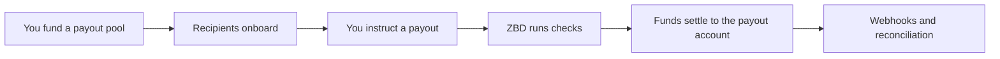

Embedded Payouts puts the whole payout experience inside your own game or platform. Users verify, choose how they want to be paid and get their money without leaving your product or signing up with a separate payee portal.

## How it's different

- **Inside your product.** Verification, payment method selection and cash out run in your game or site, in flows you place where you want them.
- **On demand or on your schedule.** Pay a user the moment they're owed, or run payouts on whatever cadence suits your program, like weekly or monthly.
- **The user chooses the method, and the cost.** Users pick how and how fast they're paid from the methods available in their country. Some methods are free or low cost, and faster ones cost more. Because the user makes that choice, the fee comes out of their payout by default, so you don't need payout minimums to keep costs down. You can choose to cover the fee yourself if you'd rather.
- **ZBD carries the compliance.** Identity verification, screening, tax information and payment details are handled and stored by ZBD, outside your systems.

## What it's for

- Creator and UGC revenue share
- Marketplace seller payouts
- Tournament and prize distribution
- Player reward cash out

## How it works

1. [**Fund a pool**](/embedded-payouts/funding)**.** Pre-fund a payout pool in your funding currency, and top it up before it runs dry.
2. [**Onboard users**](/embedded-payouts/users)**.** Create the user from your backend, and ZBD handles identity verification, tax information and payment method selection. Verification is tiered, and you choose when to collect it: up front, or when a payout requires it.
3. [**Pay out**](/embedded-payouts/paying-out)**.** Your ledger can be the source of truth, with ZBD holding no balance for your users, or ZBD can hold each user's balance for you. [How Payouts Work](/embedded-payouts/how-payouts-work) explains both.
4. **ZBD runs the checks.** Identity, sanctions and watchlist screening, and payout limits.
5. [**Funds settle**](/embedded-payouts/methods-and-coverage)**.** The user is paid in their own currency, to the payment method they chose.
6. **Reconcile.** Payout status changes arrive by webhook, so you can keep your own records up to date.

## Choosing your integration

Your backend always handles creating users, crediting balances, sending payout instructions and handling webhooks.

The user-facing steps run in the ZBD widget: identity verification, tax information, payment method selection and cashing out. The widget is a set of separate flows, and you choose which ones to use and where they appear in your product.

| Flow | What it does |
| --- | --- |
| Identity verification | Verifies the user and sets their tier. Can run on its own, for example at signup. |
| Payment method selection | The user chooses how to be paid from the methods available in their country. Bank accounts are linked here, and methods that need no linking, like gift cards, are chosen here too. |
| Cash out | The user withdraws from a balance ZBD holds for them. |

One session can open any of these flows without the user signing in again. For example, you might run identity verification when a creator signs up, so they're cleared before they earn anything, and payment method selection before their first payout.

If you keep the ledger and show balances in your own product, you won't need the cash out flow, since your backend sends the payout. See [Cash Out Widget](/embedded-payouts/cash-out-widget) for integration details.

ZBD collects and stores identity documents, tax identifiers and bank details in every flow, so they stay out of your systems and your compliance scope.

## What ZBD handles

- Identity verification and tiering
- Sanctions and watchlist screening
- AML monitoring
- Tax information collection
- Payment rails, FX and settlement

## Start here

[Fund your payout pool](/embedded-payouts/funding) · [Create a user](/embedded-payouts/users) · [Send your first payout](/embedded-payouts/paying-out)
