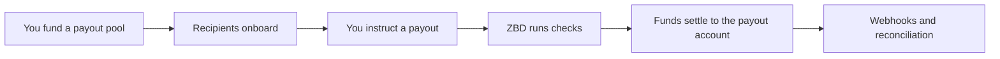

Pay creators, sellers and players anywhere in the world from a pool you fund and control. ZBD handles identity verification, screening, tax collection and the payment rails, and the sensitive data those steps involve never touches your systems.
## What it's for
- Creator and UGC revenue share
- Marketplace seller payouts
- Tournament and prize distribution
- Player reward cash out
## How it works

1. [**Fund a pool**](/embedded-payouts/funding)**.** Pre-fund a payout pool in your funding currency. Set a top-up threshold so it refills before it runs dry.
2. [**Onboard users**](/embedded-payouts/users)**.** Create the user from your backend, then hand off to ZBD for identity verification, tax information and linking a payout account. Verification is tiered, and when you collect it is your call: up front for a known set of users, or at the point a payout requires it.
3. [**Instruct a payout**](/embedded-payouts/paying-out)**.** On demand, per user. Keep your own ledger as the source of truth and treat the ZBD balance as a mirror of it, or have ZBD hold the balance directly. Both are supported.
4. **ZBD runs the checks.** Identity, sanctions and watchlist screening, and payout limits.
5. [**Funds settle**](/embedded-payouts/methods-and-coverage)**.** The user is paid in their own currency, into the payout account they linked.
6. **Reconcile.** Payout lifecycle events arrive by webhook, so you can keep your own records in step.
## Choosing your integration
Your backend handles creating users, crediting balance, issuing payout instructions and handling webhooks in every case.
The user-facing steps run on ZBD surface: identity verification, tax information and linking a payout account. What you choose is how much of that experience you compose yourself.

|   | Cash out widget | Components |
| --- | --- | --- |
| What it is | One hosted flow covering cash out end to end | Individual embeddable pieces you place in your own flow |
| You control | Entry point and theming | Layout, sequencing and the surrounding UI |
| Build effort | Lowest | Higher |
| Suits | Getting a payout program live quickly | An existing payout experience you want to keep |

These mix. A common pattern is embedding the verification component inside your own onboarding, then handing off to the [cash out widget](/embedded-payouts/cash-out-widget) for cash out itself.
Identity documents, tax identifiers and bank details are collected and stored by ZBD in both cases, which keeps it out of your systems and out of your compliance scope.
## What ZBD handles
- Identity verification and tiering
- Sanctions and watchlist screening
- AML monitoring
- Tax information collection
- Payment rails, FX and settlement
## Start here
Quickstart · [Fund your payout pool](/embedded-payouts/funding) · [Create a user](/embedded-payouts/users) · [Send your first payout](/embedded-payouts/paying-out)
