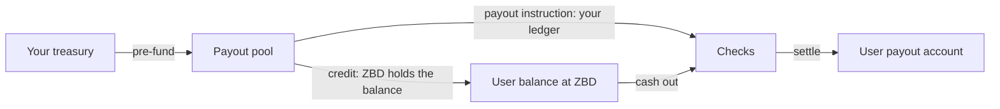

The flow of funds from the pool you fund to money in a user's account.
## The objects

| Object | What it is |
| --- | --- |
| Project | The scope a payout program runs in. Keys, settings and reporting hang off it. |
| Payout pool | The balance you pre-fund. Every payout draws from it. |
| [User](/embedded-payouts/users) | The person being paid. Carries a verification tier and a linked payout account. |
| User balance | What a user is owed, held by ZBD. Only exists when ZBD holds balances for you. If your ledger is the source of truth, ZBD holds no balance for your users. |
| Payout | A single instruction to move money to a user. |

## Flow of funds

## 1. Funding the pool
You send funds to ZBD and they sit in your [payout pool](/embedded-payouts/funding), denominated in your funding currency. Every payout draws from it, so the pool has to cover what you intend to pay before you instruct it.
Set a top-up threshold and ZBD will tell you when the balance falls below it. Read the current float at any time.
## 2. Where user balances live
Two models, chosen per program. The checks, rails and settlement are the same in both. What differs is where the money sits before a payout and where it goes if a payout fails or comes back.
**Your ledger is the source of truth.** You track what each user has earned and show their balance in your own product. ZBD holds no balance for your users. When a user should be paid, you debit them in your ledger and instruct a payout, which draws directly from your pool. Use this when you already have earnings logic, rules and history you don't want to move.
**ZBD holds the balance.** You credit users from your pool as they earn, and ZBD is the record of what each user holds. Users cash out from that balance through the widget. Use this when you'd rather not build and reconcile a ledger.
## 3. Payout accounts
Before a user can be paid, they link the account their money lands in. The widget presents the [options available in their country](/embedded-payouts/methods-and-coverage) and the user chooses among them, so you don't have to model rail availability or eligibility yourself.
Account details are collected and held by ZBD. A payout instruction references the payout account rather than carrying its details.
## 4. Starting a payout
If your ledger is the source of truth, your backend instructs each payout on demand, one user at a time. A [payout instruction](/embedded-payouts/paying-out) names the user, the amount and the payout account they linked.
If ZBD holds the balance, the user starts the payout by cashing out through the widget.
Payouts can be held before they become payable. This covers the window where the underlying transaction could still be refunded or charged back.
## 5. The checks
Every payout runs through the same sequence before funds move:

| Check | What happens |
| --- | --- |
| Verification tier | The user's tier has to allow the amount. Below it, they're prompted to step up. |
| Screening | Sanctions and watchlist screening on the user. |
| Limits | Per-payout, velocity and cumulative limits, counted across rails. |
| Funds | Your pool has to cover the payout if your ledger is the source of truth. If ZBD holds the balance, the user's balance has to cover it. |

A payout that fails a check returns a status and nothing is paid. Where the amount goes depends on your ledger model, covered in [When a payout fails](/embedded-payouts/paying-out#when-a-payout-fails).
## 6. Settlement
If the user's currency differs from your funding currency, ZBD converts at the quoted rate and the user sees the converted amount. Funds then settle on the rail behind the payout account they chose.
Settlement timing varies by method and by the user's country. [Payout methods and coverage](/embedded-payouts/methods-and-coverage) covers what affects it.
## 7. Back to you
Payout lifecycle events arrive by webhook as a payout moves through processing, completed, failed or returned. Use them to keep your own records in step and to show users where their payout stands.
