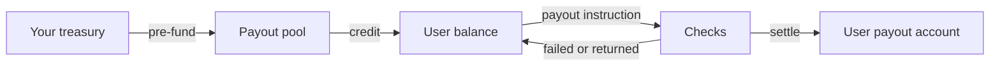

The flow of funds from the pool you fund to money in a user's account.
## The objects

| Object | What it is |
| --- | --- |
| Project | The scope a payout program runs in. Keys, settings and reporting hang off it. |
| Payout pool | The balance you pre-fund. Every payout draws from it. |
| [User](/embedded-payouts/users) | The person being paid. Carries a verification tier and a linked payout account. |
| User balance | What a user is owed. Either mirrors your ledger or is held by ZBD. |
| Payout | A single instruction to move money to a user. |

## Flow of funds

## 1. Funding the pool
You send funds to ZBD and they sit in your [payout pool](/embedded-payouts/funding), denominated in your funding currency. Every payout draws from it, so the pool has to cover what you intend to pay before you instruct it.
Set a top-up threshold and ZBD will tell you when the balance falls below it. Read the current float at any time.
## 2. Crediting a user
Two models, chosen per program:
**Your ledger is the source of truth.** You track what each user has earned in your own systems. The balance ZBD holds mirrors yours, and you keep them in step. Use this when you already have earnings logic, rules and history you don't want to move.
**ZBD holds the balance.** You credit users as they earn and ZBD is the record. Use this when you'd rather not build and reconcile a ledger.
Either way the payout mechanics below are identical.
## 3. Payout accounts
Before a user can be paid, they link the account their money lands in. The widget presents the [options available in their country](/embedded-payouts/methods-and-coverage) and the user chooses among them, so you don't have to model rail availability or eligibility yourself.
Account details are collected and held by ZBD. A payout instruction references the payout account rather than carrying its details.
## 4. Instructing a payout
On demand, one user at a time. A [payout instruction](/embedded-payouts/paying-out) names the user, the amount and the payout account they linked.
Payouts can be held before they become payable. This covers the window where the underlying transaction could still be refunded or charged back.
## 5. The checks
Every payout runs through the same sequence before funds move:

| Check | What happens |
| --- | --- |
| Verification tier | The user's tier has to allow the amount. Below it, they're prompted to step up. |
| Screening | Sanctions and watchlist screening on the user. |
| Limits | Per-payout, velocity and cumulative limits, counted across rails. |
| Funds | The pool has to cover the payout. |

A payout that fails a check returns a status, and the amount stays with the user.
## 6. Settlement
If the user's currency differs from your funding currency, ZBD converts at the quoted rate and the user sees the converted amount. Funds then settle on the rail behind the payout account they chose.
Settlement timing varies by method and by the user's country. [Payout methods and coverage](/embedded-payouts/methods-and-coverage) covers what affects it.
## 7. Back to you
Payout lifecycle events arrive by webhook as a payout moves through processing, completed, failed or returned. Use them to keep your own records in step and to show users where their payout stands.
