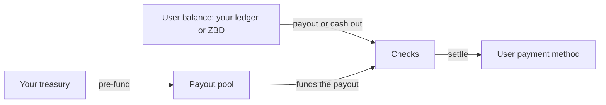

## The objects

| Object | What it is |
| --- | --- |
| Project | The scope a payout program runs in. Keys, settings and reporting belong to it. |
| Payout pool | The balance you pre-fund. Every payout draws from it. |
| [User](/embedded-payouts/users) | The person being paid. Has a verification tier and a payment method. |
| User balance | What a user is owed, held by ZBD. Only used when ZBD holds balances for you. |
| Payout | A single instruction to move money to a user. |

## Flow of funds

## 1. Funding the pool

You send funds to ZBD and they sit in your [payout pool](/embedded-payouts/funding), in your funding currency. Every payout draws from the pool, so it needs to cover a payout at the moment it's initiated.

Agree a low-balance level with ZBD so you know when to top up. [Payout Pools](/embedded-payouts/funding) covers keeping the pool funded.

## 2. Where user balances live

There are two ways to track what users are owed. Funding, checks, payment rails and settlement are the same in both, and either way your pool only needs to cover a payout when it's initiated. The difference is who keeps the balance, and where the amount goes if a payout fails or is returned.

**Your ledger is the source of truth.** You track what each user has earned and show their balance in your own product, and ZBD holds no balance for them. When a user should be paid, you debit them in your ledger and send a payout instruction. This works well if you already have earnings logic and history you want to keep.

**ZBD holds the balance.** You credit users as they earn, and ZBD keeps the record of what each user holds. Users cash out from that balance through the widget. This works well if you don't want to build and reconcile a ledger.

## 3. Payment methods

Before a user can be paid, they choose a payment method from the [options available in their country](/embedded-payouts/methods-and-coverage), and link it if it's a bank account. You don't need to model which methods are available where.

ZBD collects and holds the details. A payout instruction refers to the payment method instead of carrying its details.

## 4. Starting a payout

If your ledger is the source of truth, your backend sends each payout instruction when you decide a user should be paid. A [payout instruction](/embedded-payouts/paying-out) names the user, the amount and their payment method.

If ZBD holds the balance, the user starts the payout by cashing out through the widget.

A payout can be held before it's paid, while the transaction behind it could still be refunded or charged back.

## 5. The checks

Every payout goes through the same checks before any money moves:

| Check | What happens |
| --- | --- |
| Verification tier | The user's tier has to allow the amount. If it doesn't, they're prompted to verify further. |
| Screening | Sanctions and watchlist screening on the user. |
| Limits | Per-payout, velocity and cumulative limits, counted across all payment methods. |
| Funds | Your pool has to cover the payout. If ZBD holds the balance, the user's balance has to cover it too. |

If a payout fails a check, nothing is paid. Where the amount goes depends on your ledger model, as covered in [When a payout fails](/embedded-payouts/paying-out#when-a-payout-fails).

## 6. Settlement

If the user's currency is different from your funding currency, ZBD converts at the quoted rate and shows the user the converted amount. The money then settles to the payment method they chose.

Timing depends on the method and the user's country. [Payout Methods](/embedded-payouts/methods-and-coverage) covers what affects it.

## 7. Webhooks

A webhook fires each time a payout moves to processing, completed, failed or returned. Use them to keep your records up to date and to show users where their payout is.
