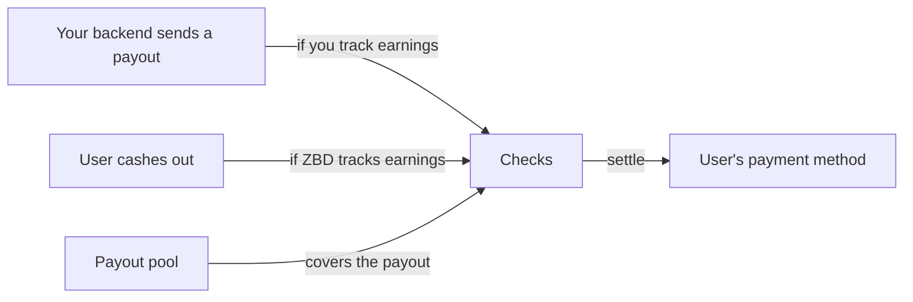
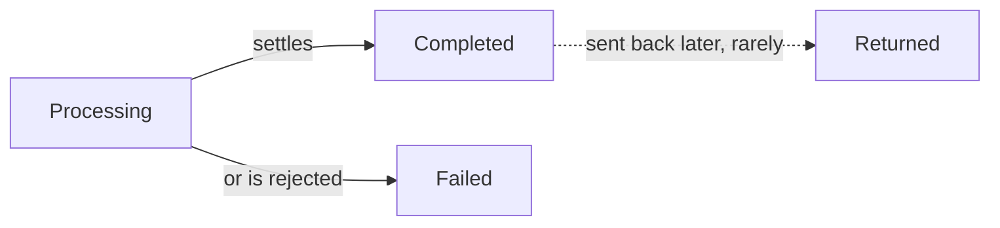

## Two ways to track earnings

Before you integrate, decide who keeps track of what each user has earned. Funding, checks, payment methods and settlement work the same either way.

| | You track earnings | ZBD tracks earnings |
| --- | --- | --- |
| Who records what users are owed | You, in your own system | ZBD |
| How money goes out | Your backend sends each payout | The user cashes out in the widget |
| Verification | Full verification up front, before the first payout | Tiered. Users can start small and verify further as their earnings grow |
| If a payout fails or is returned | The amount goes back to your pool, and you add it back in your own system | The amount goes back to the user's earnings on ZBD |
| Good fit if | You already have earnings logic, rules and history | You'd rather not build and reconcile your own records |
| Guide | [Tracking Earnings Yourself](/embedded-payouts/tracking-earnings-yourself) | [Tracking Earnings With ZBD](/embedded-payouts/tracking-earnings-with-zbd) |

## The objects

| Object | What it is |
| --- | --- |
| Project | The scope a payout program runs in. Keys, settings and reporting belong to it. |
| [Payout pool](/embedded-payouts/funding) | The funds you set aside for payouts. Every payout draws from it. |
| [User](/embedded-payouts/users) | The person being paid. Has a verification status and a payment method. |
| Earnings | What a user is owed and hasn't been paid yet. ZBD only tracks this if you choose that model. |
| Payout | A single movement of money from your pool to one user's payment method. A cash out in the widget creates a payout too. |

## Flow of funds

A payout names the user, the amount and the [payment method](/embedded-payouts/methods-and-coverage) the user chose. ZBD holds the payment details, so the payout only refers to the method. The amount comes out of your pool when the payout is initiated, and off the user's earnings too if ZBD tracks them.

[Fees](/embedded-payouts/methods-and-coverage#fees) for the payment method come out of the payout by default, so the user receives less than the amount sent. If the user's currency differs from your funding currency, ZBD converts at the quoted rate.

## When to pay out

You decide when payouts happen. Common patterns:

- The user asks to cash out in your product
- You run payouts on a schedule, like weekly or monthly
- You pay automatically once a user's earnings reach a threshold you set

## Checks

Every payout goes through the same checks before any money moves:

| Check | What happens |
| --- | --- |
| Verification | The user has to be verified. If ZBD tracks earnings, their tier also has to allow the amount. |
| Screening | Sanctions and watchlist screening on the user. |
| Limits | Per-payout, velocity and cumulative limits, counted across all payment methods. |
| Funds | Your pool has to cover the payout. If ZBD tracks earnings, the user's earnings have to cover it too. |

## Payout statuses

Every payout starts as Processing and ends as either Completed or Failed, never both. A completed payout can occasionally come back as Returned.

| Status | What it means |
| --- | --- |
| Processing | Checks have passed and the payout is with the payment rail. |
| Completed | Settled to the user's payment method. |
| Failed | Rejected before any money moved. |
| Returned | Settled, then sent back, usually because the account was closed or the details were wrong. Returns can arrive well after a payout looks complete. |

A webhook fires on every status change, so you don't need to poll. Settlement timing depends on the method and the user's country. See [Payout Methods](/embedded-payouts/methods-and-coverage#what-affects-timing).

## When a payout fails or is returned

Nothing is ever partially paid. Where the amount goes depends on who tracks earnings:

| | You track earnings | ZBD tracks earnings |
| --- | --- | --- |
| Failed | Back to your pool. A webhook tells you, so you can add the amount back in your own system. | Back to the user's earnings on ZBD. |
| Returned | Back to your pool when the return arrives, with a webhook so you can add the amount back in your own system. | Back to the user's earnings on ZBD when the return arrives. |

Common reasons a payout fails:

| Reason | What to do |
| --- | --- |
| Not verified, or tier too low if ZBD tracks earnings | Prompt the user to verify, then try again once they're cleared |
| Screening | Don't share details with the user. These need manual review. |
| Limit reached | Show the user when the limit resets |
| Pool short | Top up and try again. There's no need to tell the user. |
| No payment method | Prompt the user to choose one |

## What to show users

Users mostly want to know whether their money is on the way, when it'll arrive, and whether anything is blocking it. Showing the payout status directly usually works better than creating your own labels for it.
