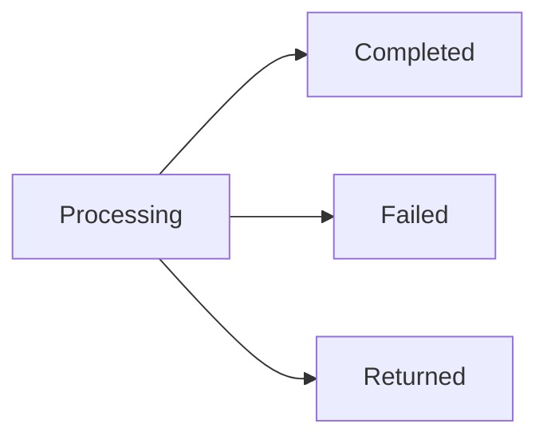

A payout moves money into a user's payout account. If your ledger is the source of truth, you instruct each one from your backend and it draws from your pool. If ZBD holds the balance, the user cashes out from their ZBD balance through the widget. Either way, a payout covers one user at a time.
## What triggers a payout is yours to decide
Nothing schedules payouts for you. Common patterns:
- The user asks for a cash out in your product
- You run payouts on a cycle, weekly or monthly
- You pay automatically once a balance crosses a threshold you set
Which one fits depends on your economy, and a creator program usually wants something different from a rewards program.
## Instructing a payout
An instruction carries three things: the [user](/embedded-payouts/users), the amount, and the [payout account](/embedded-payouts/methods-and-coverage) they linked. ZBD resolves the rest at that moment, including the user's tier, the rail behind their account, and the conversion rate if their currency differs from your funding currency.
The amount you instruct is debited from your [pool](/embedded-payouts/funding) if your ledger is the source of truth, or from the user's ZBD balance if ZBD holds it. [Fees](/embedded-payouts/methods-and-coverage) for the method the user chose come out of their proceeds, so what lands in their account is lower than what you instructed.
Send an idempotency key with every instruction, so that a timeout or a retry on your side doesn't result in the user being paid twice.
## Lifecycle

| State | What it means |
| --- | --- |
| Processing | Accepted and moving. Checks have passed and the payout is with the rail. |
| Completed | Settled into the user's payout account. |
| Failed | Rejected before any money moved. Where the amount goes depends on your ledger model, see below. |
| Returned | Settled, then came back, usually because the account was closed or the details were wrong. |

Each transition raises a webhook, so you don't have to poll for status.
## Holds
A payout can be held before it becomes payable, covering the window where the transaction that funded it could still be refunded or charged back. A held payout isn't stuck, it releases on its own once that window closes.
Recipients notice holds more than anything else in this flow, so it's worth showing them the release date rather than a generic pending state.
## When a payout fails
A failed payout returns a status and nothing is partially paid. Where the amount goes depends on who holds the user's balance:

| | Your ledger is the source of truth | ZBD holds the balance |
| --- | --- | --- |
| Failed | The amount goes back to your pool. A webhook tells you, so you can restore the user's balance in your ledger. | The amount goes back to the user's ZBD balance. |
| Returned | The amount goes back to your pool when the return arrives, with a webhook so you can restore the user's balance. | The amount goes back to the user's ZBD balance when the return arrives. |

Common reasons a payout fails:

| Reason | What to do |
| --- | --- |
| Tier too low | Prompt the user to verify, then re-instruct once they clear |
| Screening | Don't surface details to the user, these need a person to look at them |
| Limit reached | Show the user when the limit resets |
| Pool short | Top up and re-instruct, and don't surface it to the user |
| No payout account | Prompt the user to link one |

## Returns
A payout can settle and still come back. The usual causes are a closed account or details that didn't match. The amount is restored to your pool or to the user's ZBD balance, following the table above.
Returns can arrive well after a payout looks complete, so treat returned as a state a finished payout can still enter rather than a failure mode that only shows up early.
## What to show users
The states above map to a small number of things a user actually cares about: whether their money is on the way, when it lands, and whether something is blocking it. Surfacing the payout state directly usually works better than inventing your own vocabulary on top of it.
