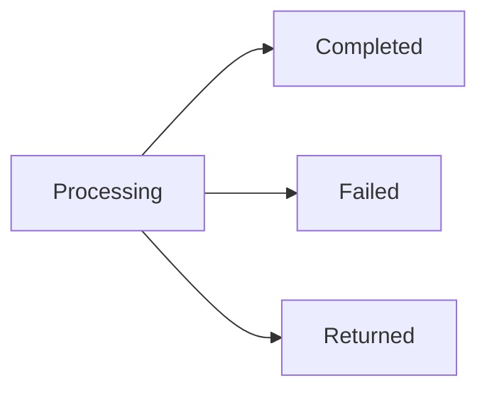

If your ledger is the source of truth, your backend instructs each payout. If ZBD holds the balance, the user cashes out from their ZBD balance through the widget. Each payout covers one user.

## When to pay out

You decide when payouts happen. Common patterns:

- The user asks to cash out in your product
- You run payouts on a schedule, like weekly or monthly
- You pay automatically once a balance reaches a threshold you set

The right pattern depends on your program. A creator program often works differently from a rewards program.

## Instructing a payout

A payout instruction includes the [user](/embedded-payouts/users), the amount and the [payment method](/embedded-payouts/methods-and-coverage) they chose. ZBD works out the rest at the time of the payout, including the user's tier, the payment rail and any currency conversion.

The amount is debited from your [pool](/embedded-payouts/funding) when the payout is initiated. If ZBD holds the balance, it's also debited from the user's ZBD balance. [Fees](/embedded-payouts/methods-and-coverage) for the user's payment method come out of the payout, so the user receives less than the amount instructed.

Send an idempotency key with every instruction, so a timeout or retry doesn't pay the user twice.

## Lifecycle

| Status | What it means |
| --- | --- |
| Processing | Checks have passed and the payout is with the payment rail. |
| Completed | Settled to the user's payment method. |
| Failed | Rejected before any money moved. Where the amount goes depends on your ledger model, see below. |
| Returned | Settled, then sent back, usually because the account was closed or the details were wrong. |

Each status change triggers a webhook, so you don't need to poll.

## Holds

A payout can be held before it's paid, while the transaction that funded it could still be refunded or charged back. The hold releases on its own when that window closes.

Users notice holds more than anything else in this flow, so show them the release date instead of a generic pending status.

## When a payout fails

If a payout fails, nothing is partially paid. Where the amount goes depends on who holds the user's balance:

| | Your ledger is the source of truth | ZBD holds the balance |
| --- | --- | --- |
| Failed | The amount goes back to your pool. A webhook tells you, so you can restore the user's balance in your ledger. | The amount goes back to the user's ZBD balance. |
| Returned | The amount goes back to your pool when the return arrives, with a webhook so you can restore the user's balance. | The amount goes back to the user's ZBD balance when the return arrives. |

Common reasons a payout fails:

| Reason | What to do |
| --- | --- |
| Tier too low | Prompt the user to verify, then re-instruct once they're cleared |
| Screening | Don't share details with the user. These need manual review. |
| Limit reached | Show the user when the limit resets |
| Pool short | Top up and re-instruct. There's no need to tell the user. |
| No payment method | Prompt the user to choose one |

## Returns

A payout can be returned after it settles, usually because the account was closed or the details didn't match. The amount goes back to your pool or the user's ZBD balance, as shown above.

Returns can arrive well after a payout looks complete, so plan for a completed payout moving to returned.

## What to show users

Users mostly want to know whether their money is on the way, when it'll arrive, and whether anything is blocking it. Showing the payout status directly usually works better than creating your own labels for it.
