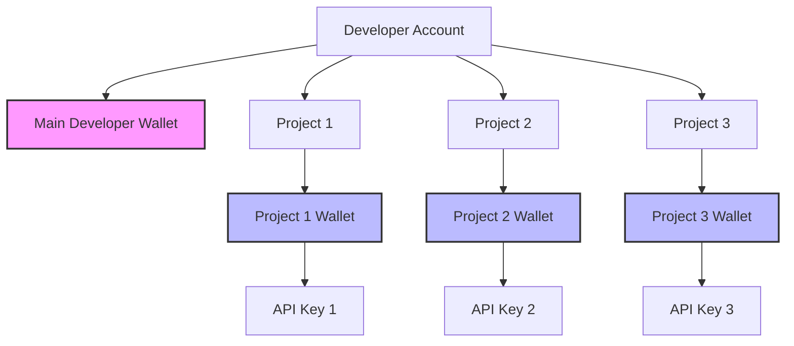

Every ZBD project comes with its own programmable Bitcoin Lightning wallet. This isolated wallet gives you complete control over your project's funds, transactions, and financial operations – all accessible via API.

<Info>
  **Core Architecture**: 1 Project = 1 Wallet = 1 API Key. This separation ensures clean accounting, isolated risk, and granular control.
</Info>

## How Project Wallets Work

<CardGroup cols={3}>
  <Card title="Isolated Funds" icon="shield">
    Each project has its own Bitcoin balance, completely separate from other projects
  </Card>
  <Card title="API Controlled" icon="code">
    Every transaction through your API key affects only this wallet
  </Card>
  <Card title="Real-time Updates" icon="bolt">
    Balance changes instantly with Lightning-speed settlements
  </Card>
</CardGroup>

### Wallet Architecture



## Wallet Dashboard

Navigate to your project's **Wallet** tab to access comprehensive financial data:

<Frame caption="Project wallet dashboard showing balance and transactions">
  
</Frame>

## Wallet Management Best Practices

<AccordionGroup>
  <Accordion title="Maintain Adequate Balance" icon="coins">
    **Buffer Recommendation**: Keep 1.5x your daily volume
    
    - Monitor daily burn rate
    - Automate top-ups if possible
    - Plan for traffic spikes
  </Accordion>
  <Accordion title="Security Practices" icon="shield">
    **Protect Your Funds**
    
    - Use IP allowlisting for API keys
    - Enable 2FA on your account
    - Regularly audit transactions
    - Set up webhook notifications
  </Accordion>
  <Accordion title="Multi-Project Strategy" icon="folder">
    **When to Use Multiple Projects**
    
    - Different apps/games
    - Staging vs production
    - Regional separation
    - Department budgets
  </Accordion>
  <Accordion title="Accounting Integration" icon="calculator">
    **Financial Tracking**
    
    - Export transactions monthly (talk to your Customer Success Manager)
    - Use reference IDs for reconciliation
    - Track by project for clean books
    - Integrate with accounting software
  </Accordion>
</AccordionGroup>

## Common Wallet Operations

### Check Balance
<CodeGroup>
```javascript Node.js
const wallet = await zbd.getWallet();
console.log(`Balance: ${wallet.balance} sats`);
console.log(`USD Value: $${wallet.balanceUSD}`);
```

```bash cURL
curl https://api.zbdpay.com/v0/wallet \
  -H "apikey: YOUR_PROJECT_API_KEY"
```
</CodeGroup>

### Transfer Between Projects
<CodeGroup>
```javascript Node.js
// Transfer funds between your projects
const result = await zbd.internalTransfer({
  amount: 10000,
  receiverWalletId: 'project_abc123',
  reference: 'Budget reallocation'
});
```

```bash cURL
curl -X POST https://api.zbdpay.com/v0/internal-transfer \
  -H "apikey: YOUR_PROJECT_API_KEY" \
  -H "Content-Type: application/json" \
  -d '{
    "amount": "10000",
    "receiverWalletId": "project_abc123"
  }'
```
</CodeGroup>

## Next Steps

<CardGroup cols={2}>
  <Card title="Send First Payment" icon="paper-plane" href="/payments/sdk/typescript">
    Make your first Lightning payment
  </Card>
  <Card title="Set Up Webhooks" icon="webhook" href="/payments/api/callbacks">
    Monitor transaction updates in real-time
  </Card>
</CardGroup>

---

<Note>
  **Pro Tip**: Use project wallets to isolate financial risk. If one project has issues, your other projects remain unaffected. This is especially important for testing new features or running experiments.
</Note>