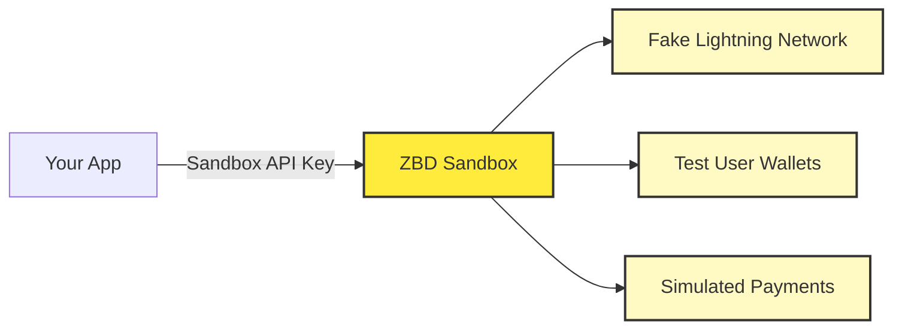

Every developer's journey with ZBD starts in the sandbox. It's your risk-free playground where you can test payments, break things, and perfect your integration before touching real money.

<Info>
  **Default Environment**: All new projects start as sandbox projects. This protects you from accidentally spending real Bitcoin while learning the platform.
</Info>

## What Makes Sandbox Special

<CardGroup cols={2}>
  <Card title="Fake Bitcoin" icon="bitcoin">
    10,000 free satoshis to start, top up anytime
  </Card>
  <Card title="Test Users" icon="users">
    Pre-created users with wallets for end-to-end testing
  </Card>
</CardGroup>

### Visual Indicators

Sandbox projects are clearly marked to prevent confusion:

<Frame caption="Sandbox projects show clear labeling in the dashboard">
  
</Frame>

Look for:
- 🧪 **"Sandbox" label** on project cards
- 🎮 **Test Bitcoin balance** (not real money!)
- 👥 **Test Users tab** only in sandbox
- 🔑 **Sandbox API endpoints** in documentation

## Sandbox Architecture



## Getting Started with Sandbox

### Your First Sandbox Project

When you create your first project, you'll automatically get:

<Steps>
  <Step title="Sandbox Wallet">
    Pre-funded with 10,000 fake satoshis
  </Step>
  <Step title="Sandbox API Key">
    Works only with sandbox endpoints
  </Step>
  <Step title="Test Users">
    5 pre-created users with ZBD gamertags
  </Step>
  <Step title="Full API Access">
    All payment features available for testing
  </Step>
</Steps>

### Test Users

Click the **Test Users** tab to see your pre-created testing accounts:

<Frame caption="Pre-created test users for payment testing">
  
</Frame>

Each test user has:
- Unique ZBD Gamertag
- Test wallet with balance
- Ability to receive payments
- Full transaction history

**Example Test Users**:
```
- SandboxUser1#7823
- TestPlayer42#1337  
- DevTester99#2024
```

## Topping Up Your Sandbox

Running low on fake satoshis? Add more instantly:

<Frame caption="Top up your sandbox wallet with one click">
  
</Frame>

<CardGroup cols={2}>
  <Card title="Instant Top-up" icon="plus">
    Click "Top Up" for +10,000 sats instantly
  </Card>
  <Card title="Unlimited Refills" icon="infinity">
    No limits - top up as many times as needed
  </Card>
</CardGroup>

## Sandbox API Endpoints

Sandbox uses separate endpoints to ensure you never accidentally mix test and production:

```
Base URL: https://sandbox.api.zbdpay.com

Example endpoints:
- /v0/gamertag/send
```

<Warning>
  **Currently Limited**: Only the Send to Gamertag API is available in sandbox. More endpoints coming soon. For full API testing, complete verification for production access.
</Warning>

## Testing Payments in Sandbox

Let's send your first test payment:

### 1. Get Your Sandbox API Key

<Frame caption="Copy your sandbox API key from the API tab">
  
</Frame>

### 2. Send Test Payment

Use the API Playground or your own code:

<CodeGroup>
```bash cURL
curl -X POST https://sandbox.api.zbdpay.com/v0/gamertag/send \
  -H "apikey: YOUR_SANDBOX_API_KEY" \
  -H "Content-Type: application/json" \
  -d '{
    "gamertag": "SandboxUser1#7823",
    "amount": "100",
    "description": "Test payment!"
  }'
```

```javascript Node.js
const response = await fetch('https://sandbox.api.zbdpay.com/v0/gamertag/send', {
  method: 'POST',
  headers: {
    'apikey': process.env.SANDBOX_API_KEY,
    'Content-Type': 'application/json'
  },
  body: JSON.stringify({
    gamertag: 'SandboxUser1#7823',
    amount: '100',
    description: 'Test payment!'
  })
});

const result = await response.json();
console.log('Payment sent!', result);
```
</CodeGroup>

### 3. Verify Success

Check your sandbox wallet to see the transaction:

<Frame caption="Transaction appears instantly in your sandbox wallet">
  
</Frame>

Click on the transaction for full details:

<Frame caption="Detailed view of sandbox transactions">
  
</Frame>

## Transitioning to Production

Ready to handle real money? Here's your checklist:

<Steps>
  <Step title="Complete Testing">
    - All payment flows tested
    - Error handling verified
    - Webhook integration working
    - Performance acceptable
  </Step>
  <Step title="Verify Identity">
    Complete KYB process for production access
  </Step>
  <Step title="Create Production Project">
    New project with production API key
  </Step>
  <Step title="Update Your Code">
    - Change API endpoints
    - Update API key
    - Enable production monitoring
    - Set up error alerts
  </Step>
  <Step title="Go Live!">
    Start with small real transactions
  </Step>
</Steps>

## Troubleshooting Sandbox

<CardGroup cols={2}>
  <Card title="API Key Not Working" icon="key">
    Ensure you're using sandbox endpoints with sandbox keys
  </Card>
  <Card title="Can't Find Test Users" icon="users">
    Test Users tab only appears in sandbox projects
  </Card>
  <Card title="Need More APIs" icon="code">
    Complete verification for full API access in production
  </Card>
  <Card title="Webhook Issues" icon="webhook">
    Sandbox webhooks work identically to production
  </Card>
</CardGroup>

## Next Steps

You've mastered the sandbox! Time to level up:

<CardGroup cols={3}>
  <Card title="Verify Identity" icon="user-check" href="/get-started/verify-identity">
    Complete KYB for production access
  </Card>
  <Card title="API Reference" icon="book" href="/payments/api">
    Explore all available endpoints
  </Card>
  <Card title="Go Production" icon="rocket" href="/get-started/create-project">
    Create your first production project
  </Card>
</CardGroup>

---

<Note>
  **Remember**: Sandbox is your friend. Test everything here first. Break things, experiment, and learn. That's what it's for! When you're confident everything works, production is just an endpoint change away.
</Note>