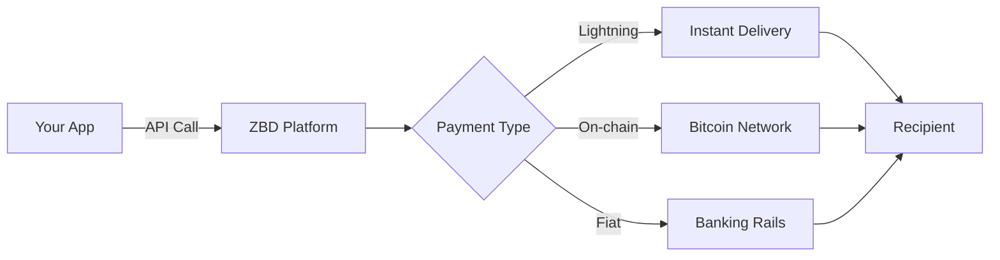

Build global payment experiences that actually work. ZBD Payments provides instant, low-cost money movement across major Tier 1 markets (US, EU, etc) using Bitcoin, Lightning Network, and traditional currencies - all through a single API.

<CardGroup cols={2}>
  <Card title="Lightning Fast" icon="bolt">
    Sub-second global payments with Lightning Network. No waiting, no borders.
  </Card>
  <Card title="Multi-Currency" icon="coins">
    Accept and send USD, EUR, and BTC. One API, multiple currencies.
  </Card>
  <Card title="Gaming Scale" icon="gauge-high">
    Built for millions of microtransactions. Handle millions of transactions with ease.
  </Card>
  <Card title="Developer First" icon="code">
    Simple APIs, comprehensive SDKs, and documentation that doesn't suck.
  </Card>
</CardGroup>

## Why ZBD Payments?

### The Problem with Traditional Payments

<Tabs>
  <Tab title="Microtransaction Hell">
    **Card Networks:**
    - Minimum ~$0.30 fee per transaction
    - Can't send 0.10c when fees are 0.30c
    - Chargebacks eat profits
    - High decline rates
    
    **ZBD Payments:**
    - Send amounts as low as $0.001
    - Proportional fees (typically < 1%)
    - No chargebacks
    - Near 100% success rate
  </Tab>
  <Tab title="Developer Friction">
    **Legacy Providers:**
    - Complex integration (weeks/months)
    - Different APIs per country
    - Compliance nightmares
    - Poor documentation
    
    **ZBD Payments:**
    - Single API globally
    - 5-minute quick start
    - Compliance built-in
    - Stripe-quality docs
  </Tab>
  <Tab title="Cross-Border Nightmare">
    **Traditional Systems:**
    - 3-5 day settlement times
    - $25-45 fees per transaction
    - Limited to banking hours
    - Blocked in many countries
    
    **ZBD Payments:**
    - Instant settlement (< 1 second)
    - Fees from $0.0001
    - 24/7/365 availability
    - Works in globally
  </Tab>
</Tabs>

## How It Works

### Core Concepts

<AccordionGroup>
  <Accordion title="Lightning Network" icon="bolt">
    Bitcoin's Layer 2 scaling solution enabling instant, low-cost payments. Think of it as the Visa network for Bitcoin - same security, 1000x faster.
    
    **Key Benefits:**
    - Instant settlement (< 1 second)
    - Fees typically < $0.01
    - Millions of TPS capacity
    - Perfect for gaming microtransactions
  </Accordion>
  <Accordion title="Lightning Address" icon="at">
    Human-readable payment addresses like `user@zbd.gg`. No more copying long Bitcoin addresses. Works like email for money.
    
    **Why It Matters:**
    - Memorable usernames
    - No QR codes needed
    - Works across all Lightning wallets
    - Perfect for in-game identities
  </Accordion>
</AccordionGroup>

## Products & Features

### 🚀 ZBD Ramp
Let users buy Bitcoin directly in your app. First widget to support Lightning Address delivery.

<Card title="Learn About Ramp" icon="circle-dollar-to-slot" href="/payments/ramp">
  Embeddable widget • Built-in KYC • Multiple payment methods
</Card>

### ⚡ Payments API
Send and receive payments globally via our REST API.

<Card title="Explore Payments API" icon="server" href="/payments/api">
  Instant settlements • Global reach • Bitcoin Lightning Network
</Card>

### 🛠️ Developer SDKs
Production-ready SDKs for popular languages and frameworks. Get building in minutes, not weeks.

<Card title="View SDKs" icon="cube" href="/payments/sdk">
  TypeScript • Go • Rust • C# • More coming
</Card>

## Use Cases

### Gaming & Virtual Worlds

<CardGroup cols={2}>
  <Card title="In-Game Purchases">
    - Instant item purchases
    - No minimum transaction
    - Global player base
    - Zero chargebacks
  </Card>
  <Card title="Player Trading">
    - P2P marketplaces
    - Instant settlement
    - Cross-border trades
    - Low fees = more profit
  </Card>
  <Card title="Tournament Payouts">
    - Instant winner payouts
    - Any amount, any country
    - No banking details needed
    - Automated via API
  </Card>
  <Card title="Creator Economies">
    - Pay mod creators
    - Revenue sharing
    - Micropayments work
    - Global participation
  </Card>
</CardGroup>

### Apps & Platforms

<CardGroup cols={2}>
  <Card title="Content Monetization">
    Pay-per-article, pay-per-view, tips - amounts too small for cards
  </Card>
  <Card title="Gig Economy">
    Instant payouts to workers globally without bank accounts
  </Card>
  <Card title="Remittances">
    Send money home instantly with fees under $0.01
  </Card>
  <Card title="SaaS Billing">
    Usage-based billing down to fractions of a cent
  </Card>
</CardGroup>

## Compliance & Security

### Built-in Compliance
- **KYC/AML**: Automated identity verification where required
- **Sanctions Screening**: Real-time OFAC and international lists
- **Transaction Monitoring**: AI-powered fraud detection
- **Regulatory Licenses**: Money transmission licenses in key markets

### Security First
- **End-to-end Encryption**: All data encrypted in transit and at rest
- **API Key Security**: Scoped permissions and IP allowlisting
- **Webhook Signatures**: Cryptographic verification of all events
- **SOC 2 Type II**: Annual security audits

## Pricing

<Card title="Talk to Sales" icon="comments-dollar" href="https://zbd.one/sales">
  **Custom Pricing** - We offer competitive rates based on your volume and use case. Schedule a call to discuss pricing that works for your business.
</Card>

### What Affects Pricing
- Transaction volume
- Average transaction size  
- Geographic distribution
- Settlement preferences
- Support level needed

## Start Building

<Steps>
  <Step title="Get Your API Keys">
    [Schedule a call](https://zbd.one/sales) with our team to get access
  </Step>
  <Step title="Choose Your Product">
    Pick between Ramp, Payments API, or both
  </Step>
  <Step title="Follow the Guides">
    Use our quick start guides to integrate in minutes
  </Step>
  <Step title="Go Live">
    Start processing real payments with production keys
  </Step>
</Steps>

<CardGroup cols={3}>
  <Card title="Ramp" icon="circle-dollar-to-slot" href="/payments/ramp">
    Let users buy Bitcoin
  </Card>
  <Card title="SDKs" icon="cube" href="/payments/sdk">
    TypeScript, Go, Rust & more
  </Card>
  <Card title="API Reference" icon="code" href="/payments/api">
    Complete API documentation
  </Card>
</CardGroup>

---

## Need Help?

<CardGroup cols={2}>
  <Card title="Sales" icon="phone" href="https://zbd.one/sales">
    Get API keys and discuss your use case
  </Card>
  <Card title="Support" icon="headset" href="https://help.zbdpay.com">
    Technical help from our engineering team
  </Card>
</CardGroup>