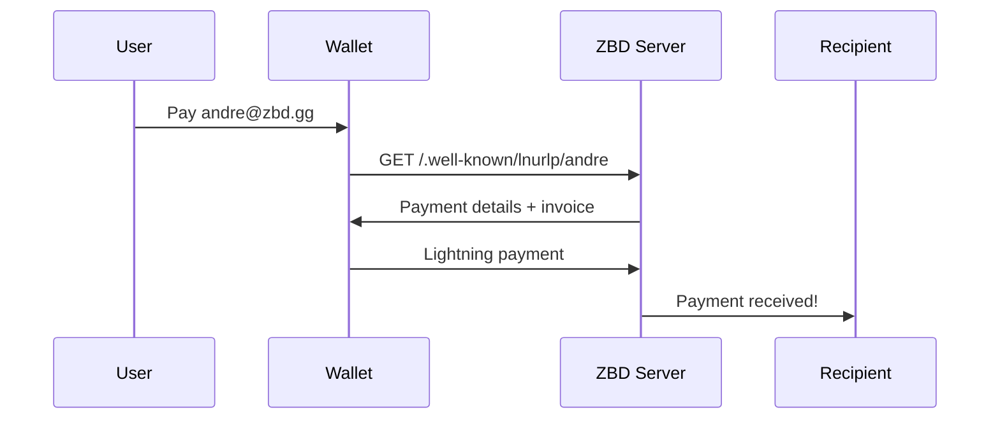

Lightning Address is the protocol that made Bitcoin payments as simple as sending an email. Created by Andre Neves (CTO of ZBD) in 2021, it has become the standard for user-friendly Bitcoin payments, processing millions of transactions across hundreds of apps and services globally.

<Info>
  **Fun Fact**: Lightning Address was invented at ZBD to solve a real problem – our users were terrified of long Bitcoin Lightning invoices. Today, it's an open protocol used by the entire Lightning ecosystem.
</Info>

<CardGroup cols={3}>
  <Card title="Human Readable" icon="at">
    user@domain.com instead of lnbc1pvjluezpp5qqqsyq...
  </Card>
  <Card title="Reusable" icon="recycle">
    One address, unlimited payments. No more invoice generation.
  </Card>
  <Card title="Interoperable" icon="link">
    Works across all supporting wallets and services globally.
  </Card>
</CardGroup>

## The UX Revolution

### Before Lightning Address (2009-2021)

```bash
# Bitcoin address (hard to remember, changes each time)
bc1qxy2kgdygjrsqtzq2n0yrf2493p83kkfjhx0wlh

# Lightning invoice (expires, single use, even longer)
lnbc1pvjluezpp5qqqsyqcyq5rqwzqfqqqsyqcyq5rqwzqfqqqsyqcyq5rqwzqfqypqdpl2pkx2ctnv5sxxmmwwd5kgetjypeh2ursdae8g6twvus8g6rfwvs8qun0dfjkxaq8rkx3yf5tcsyz3d73gafnh3cax9rn449d9p5uxz9ezhhypd0elx87sjle52x86fux2ypatgddc6k63n7erqz25le42c4u4ecky03ylcqca784w
```

**Problems:**
- 🤯 Impossible to memorize
- ⏱️ Invoices HAVE to expire at a certain time
- 🔄 New address / invoice needed for each payment
- 📱 Required QR codes or copy-paste

### After Lightning Address (2021-Present)

```bash
# Lightning Address (simple, permanent, reusable)
andre@zbd.gg
```

**Solved:**
- ✅ Easy as email – memorizable and shareable
- ✅ Works 24/7 – receive payments while you sleep
- ✅ One address forever – put it in your bio
- ✅ No QR codes needed – just type it

## How Lightning Address Works

<Steps>
  <Step title="User Sends to Address">
    Sender enters `gamer@zbd.gg` in any Lightning wallet
  </Step>
  <Step title="Wallet Queries Server">
    Wallet looks up `https://zbd.gg/.well-known/lnurlp/gamer`
  </Step>
  <Step title="Server Returns Invoice">
    ZBD creates a fresh Lightning invoice for this payment
  </Step>
  <Step title="Payment Completes">
    Standard Lightning payment flows to recipient
  </Step>
</Steps>



## Real-World Impact

Since its creation in 2021, Lightning Address has transformed Bitcoin payments and ZBD is here to support it.

<CardGroup cols={1}>
  <Card title="ZBD's Ongoing Support" icon="hand-holding-heart">
    Maintaining the protocol specification, contributing improvements back to community, and advocating for widespread adoption.
  </Card>
</CardGroup>

### Success Stories

**🎮 Gaming Revolution**
- Players share addresses as gamertags
- Streamers receive tips without interruption
- Tournament payouts to `player@zbd.gg`
- Cross-game portable identity

**💸 Creator Economy**
- Artists put addresses in social bios
- Direct fan-to-creator payments
- No platform fees or restrictions
- Instant global monetization

**🌍 Global Remittances**
- Families share memorable addresses
- No bank account required
- Instant settlement, minimal fees
- Works on basic smartphones

## Why Lightning Address Matters

### 1. Mainstream-Ready UX

<Tabs>
  <Tab title="Simplicity">
    **Email Model**: Everyone understands email. Lightning Address uses the same mental model – user@domain – making Bitcoin accessible to billions.
    
    No technical knowledge required. No long strings. No QR codes. Just human-readable addresses.
  </Tab>
  <Tab title="Permanence">
    **Set It and Forget It**: Unlike invoices that expire or addresses that change, your Lightning Address is permanent. Put it on business cards, social profiles, or billboards.
    
    Receive payments 24/7/365 without generating new invoices.
  </Tab>
  <Tab title="Interoperability">
    **Universal Standard**: Send from any supporting wallet to any other supporting service. Like email, it just works across providers.
    
    ZBD to Cash App – all seamless.
  </Tab>
</Tabs>

### 2. Enhanced Privacy

- No on-chain footprint for address lookups
- Rotating invoices prevent payment correlation
- Optional sender/receiver metadata
- No public address / invoice reuse

### 3. Developer Friendly

<CodeGroup>
```javascript Node.js
// Send to Lightning Address
const payment = await zbd.sendLightningAddress({
  lnAddress: 'andre@zbd.gg',
  amount: 1000, // sats
  comment: 'Thanks for creating this!'
});

// Validate Lightning Address
const isValid = await zbd.validateLightningAddress({
  lnAddress: 'user@domain.com'
});
```

```python Python
# Create Lightning Address for user
address = zbd.create_lightning_address(
    username="newuser",
    user_id="usr_123"
)
# Returns: newuser@zbd.gg

# Receive notification on payment
@webhook_handler
def payment_received(data):
    print(f"Received {data.amount} sats")
```
</CodeGroup>

## Advanced Features

### Custom Domains

Run Lightning Address on your own domain:

```nginx
# Nginx config for yourgame.com
location /.well-known/lnurlp/ {
  proxy_pass https://api.zebedee.io/lnurlp/;
  proxy_set_header Host api.zebedee.io;
}
```

Now users can have `player@yourgame.com` addresses!

## The Future of Lightning Address
ZBD continues to evolve the protocol:

- **🔜 Multi-Currency Support**: Send USD and receive BTC seamlessly
- **🔜 Cross-Currency Payments**: Automatic currency conversion on payment
- **🔜 Bitcoin Onchain**: Support for traditional Bitcoin addresses (fallback)
- **🔜 BOLT12 Integration**: Enhanced Lightning Network features

<Info>
  **Want to onramp users directly to Lightning Addresses?** 
  
  [ZBD Onramp](/payments/onramp) is the first and only fiat-to-crypto widget that supports Lightning Address delivery. Let your users buy Bitcoin and receive it instantly at their Lightning Address!
</Info>

## Start Using Lightning Address

<Steps>
  <Step title="Get API Access">
    [Contact our team](https://cal.com/zbdpay/sales) to get your API keys
  </Step>
  <Step title="Implement Addresses">
    Use our SDKs to create and manage Lightning Addresses
  </Step>
  <Step title="Educate Users">
    Help users understand their new superpower
  </Step>
</Steps>

<CardGroup cols={3}>
  <Card title="API Reference" icon="code" href="/payments/api/lightning-address">
    Complete Lightning Address API docs
  </Card>
  <Card title="SDKs" icon="cube" href="/payments/sdk">
    Quick integration with our SDKs
  </Card>
  <Card title="Onramp" icon="circle-dollar" href="/payments/onramp">
    Onramp directly to Lightning Addresses
  </Card>
</CardGroup>

---

<Note>
  Lightning Address is an open protocol. While ZBD created and maintains it, it's free for anyone to implement. We're proud to have contributed this UX breakthrough to the Bitcoin ecosystem and continue supporting its growth.
</Note>