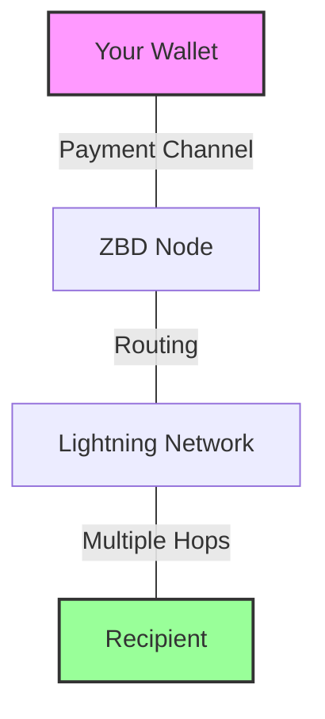

The Lightning Network transforms Bitcoin from digital gold into a global payment rail capable of millions of transactions per second. It's not just faster Bitcoin – it's an entirely new paradigm for moving money.

<CardGroup cols={3}>
  <Card title="Sub-second Speed" icon="bolt">
    Payments settle in milliseconds, not minutes or days
  </Card>
  <Card title="Fractional Costs" icon="coin">
    Send 1 cent for $0.0001 in fees. Finally, micropayments that work.
  </Card>
  <Card title="Internet Scale" icon="globe">
    Millions of TPS capacity. Built for the scale of the internet.
  </Card>
</CardGroup>

## What Makes Lightning Different

### Traditional Payments vs Lightning

<Tabs>
  <Tab title="Speed">
    **Credit Cards**: 2-3 business days to settle  
    **Bank Transfers**: 1-5 business days  
    **Bitcoin**: 10-60 minutes  
    **Lightning**: < 1 second ⚡
    
    Lightning payments are literally faster than loading a webpage.
  </Tab>
  <Tab title="Fees">
    **Credit Cards**: `2.9% + $0.30`  
    **International Wire**: `$25-50`  
    **Bitcoin**: `$1-20` (varies)  
    **Lightning**: `< $0.01` (typical)
    
    Send 1 cent profitably.
  </Tab>
</Tabs>

## New Business Models Now Possible

Lightning enables entirely new ways to monetize and transfer value that were impossible before:

### 💰 True Micropayments

Finally, payments smaller than a dollar that actually make sense:

<CardGroup cols={2}>
  <Card title="Content Monetization">
    - $0.01 to read an article
    - $0.001 per API call
    - $0.05 to skip ads
    - Tips as small as $0.0001
  </Card>
  <Card title="Gaming Economy">
    - Buy items for pennies
    - Micro-wagers on matches
    - Pay-to-play arcade style
    - Fractional tournament fees
  </Card>
</CardGroup>

### 🌍 Instant Global Settlement

Send money anywhere, instantly, 24/7/365:

```javascript
// Monday 3am in Tokyo → Sunday 2pm in New York
// Settlement: 847 milliseconds
// Fee: $0.003
// No banks involved

await zbd.send({
  amount: 1000000, // sats (~$500)
  receiver: 'business@tokyo.jp',
  comment: 'Invoice #12345'
});
```

**Unlocked Use Cases:**
- Global gig economy payments
- Cross-border gaming economies
- International remittances
- 24/7 market settlement

### ⚡ Machine-to-Machine Payments

APIs and IoT devices that pay each other automatically:

```javascript
// Car pays for parking by the second
while (parked) {
  await payParkingMeter({
    amount: 0.001, // $0.001 per second
    meterId: 'meter_sf_123'
  });
  await sleep(1000);
}
```

**Future Applications:**
- Self-paying autonomous vehicles
- IoT device micropayments
- AI agents with wallets
- Automated supply chains

## How Lightning Actually Works

Think of Lightning like having bar tabs across the internet. Instead of settling every drink immediately, you keep a running tab and settle up later.

### The Bar Tab Analogy

<Steps>
  <Step title="Open a Tab">
    You and the bartender each put $100 in a lockbox (the channel)
  </Step>
  <Step title="Track Changes">
    Each drink updates the balance. You owe more, bartender owes less.
  </Step>
  <Step title="Multi-Hop Magic">
    Your friend can pay through your tab if they know the bartender
  </Step>
  <Step title="Settle Anytime">
    Close the tab and take your remaining balance
  </Step>
</Steps>

### Technical Architecture



**Key Concepts:**

<AccordionGroup>
  <Accordion title="Payment Channels" icon="link">
    Two-party Bitcoin smart contracts that enable unlimited off-chain transactions. Only opening and closing hit the blockchain.
  </Accordion>
  <Accordion title="Network Routing" icon="route">
    Payments find the best path through multiple channels automatically. Like internet packet routing, but for money.
  </Accordion>
  <Accordion title="Atomic Swaps" icon="atom">
    HTLCs (Hash Time-Locked Contracts) ensure payments either complete fully or fail completely. No money gets stuck.
  </Accordion>
  <Accordion title="Liquidity" icon="water">
    Channels need Bitcoin on both sides to route payments. ZBD manages this complexity for you.
  </Accordion>
</AccordionGroup>

## Common Myths Debunked

<Tabs>
  <Tab title="Myth: Complexity">
    **"Lightning is too complex for users"**
    
    Reality: Users just see an email-like address (user@zbd.gg). The complexity is abstracted away, just like email hides SMTP.
  </Tab>
  <Tab title="Myth: Centralization">
    **"Lightning is centralized"**
    
    Reality: 15,000+ nodes globally. More decentralized than traditional DNS or BGP internet routing.
  </Tab>
  <Tab title="Myth: Experimental">
    **"Lightning is still experimental"**
    
    Reality: $400M+ total network capacity, processing millions of payments daily across major apps and games.
  </Tab>
</Tabs>

## Building on Lightning

### Quick Start Examples

<CodeGroup>
```javascript Node.js
// Receive streaming payments
const invoice = await zbd.createCharge({
  amount: 1000, // sats
  description: 'Power-up purchase'
});

// Send instant payment
await zbd.sendPayment({
  receiver: 'gamer@zbd.gg',
  amount: 500,
  comment: 'GG! Nice win'
});
```

```python Python
# Generate Lightning invoice
invoice = zbd.create_charge(
    amount=1000,
    description="API credits"
)

# Pay Lightning Address  
payment = zbd.send_payment(
    receiver="api@zbd.gg",
    amount=100
)
```
</CodeGroup>

### Best Practices

<CardGroup cols={2}>
  <Card title="Start Small" icon="seedling">
    Begin with simple send/receive before complex flows
  </Card>
  <Card title="Think in Sats" icon="bitcoin">
    Use satoshis (1 BTC = 100M sats) for precision
  </Card>
</CardGroup>

## The Future is Streaming Money

Lightning isn't just an improvement to payments – it's a fundamental shift in how money moves. Just as the internet packetized information, Lightning packetizes value.

### What's Next

- **AI Agents**: LLMs with Lightning wallets paying for resources
- **Streaming Contracts**: Smart contracts that execute based on payment flows  
- **Global Gaming Economies**: Truly borderless in-game currencies
- **Machine Economy**: Billions of devices transacting autonomously

<Card title="Start Building the Future" icon="rocket" href="https://cal.com/zbdpay/sales">
  Get your API keys and build the next generation of payment experiences. The internet of money is here.
</Card>

## Resources

<CardGroup cols={3}>
  <Card title="Lightning Address" icon="bolt-lightning" href="/payments/lightning-address">
    Human-readable payment addresses
  </Card>
  <Card title="API Reference" icon="code" href="/payments/api">
    Complete Lightning API docs
  </Card>
  <Card title="Integration Guide" icon="book" href="/payments/sdk">
    Step-by-step implementation
  </Card>
</CardGroup>

---

<Note>
  Lightning Network is open source and permissionless. While you can technically run your own node, ZBD handles all of the complexity of channel management, liquidity, and routing so you can focus on building great experiences.
</Note>
