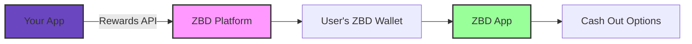

Transform user engagement with real-money rewards. The ZBD Rewards API lets you send instant Bitcoin payments to millions of users through their ZBD Gamertags – no complex integration required.

<Info>
  **Engagement as a Service** - Your users can receive and manage rewards through the ZBD App, available on iOS and Android. You focus on engagement, we handle the money rewards.
</Info>

## Why Bitcoin Rewards Work

<CardGroup cols={3}>
  <Card title="Higher Retention" icon="chart-line">
    Users come back when there's real value at stake
  </Card>
  <Card title="Viral Growth" icon="share">
    Users share apps that pay them real money
  </Card>
  <Card title="Global Reach" icon="globe">
    Works globally, no banking required
  </Card>
</CardGroup>

## How Rewards API Works



<Steps>
  <Step title="Send Reward">
    Call our API with gamertag and amount
  </Step>
  <Step title="Instant Delivery">
    Bitcoin arrives in user's ZBD wallet instantly
  </Step>
  <Step title="User Management">
    Users manage rewards in the ZBD App
  </Step>
  <Step title="Flexible Cash Out">
    Convert to USD, send to your favorite crypto exchange, spend online, get gift cards, or save
  </Step>
</Steps>

## Use Cases That Drive Results

<Tabs>
  <Tab title="Gaming">
    **Player Rewards That Matter**
    
    - 🏆 **Tournament Prizes** - Instant payouts to winners
    - 🎯 **Achievement Rewards** - Real money for milestones  
    - 👥 **Referral Bonuses** - Players recruit players
    - 🎮 **Daily Challenges** - Keep them coming back
    
  </Tab>
  <Tab title="Apps & Platforms">
    **Engagement That Pays**
    
    - 📱 **Task Completion** - Reward productive behavior
    - 📊 **Survey Incentives** - Higher completion rates
    - 🏃 **Fitness Goals** - Pay users to stay healthy
    - 📚 **Learning Rewards** - Incentivize education
    
  </Tab>
  <Tab title="Marketing">
    **Campaigns That Convert**
    
    - 📧 **Email Signups** - Real incentive to subscribe
    - 🐦 **Social Sharing** - Organic viral growth
    - ⭐ **Review Generation** - Authentic user feedback
    - 🎁 **Loyalty Programs** - Points worth real money

  </Tab>
</Tabs>

## Quick Integration Example

Send your first reward in seconds:

<CodeGroup>
```bash cURL
curl -X POST https://api.zebedee.io/v0/gamertag/send-payment \
  -H "apikey: YOUR_API_KEY" \
  -H "Content-Type: application/json" \
  -d '{
    "gamertag": "player123",
    "amount": "1000",
    "description": "Level 10 achievement!"
  }'
```

```javascript Node.js
// Send achievement reward
const reward = await fetch('https://api.zebedee.io/v0/gamertag/send-payment', {
  method: 'POST',
  headers: {
    'apikey': process.env.ZBD_API_KEY,
    'Content-Type': 'application/json'
  },
  body: JSON.stringify({
    gamertag: 'player123',
    amount: '1000', // ~$0.50
    description: 'Level 10 achievement!'
  })
});

// Instant delivery - no callbacks needed!
console.log('Reward sent!', await reward.json());
```

```python Python
import requests

# Reward user for referral
response = requests.post(
    'https://api.zebedee.io/v0/gamertag/send-payment',
    headers={
        'apikey': ZBD_API_KEY,
        'Content-Type': 'application/json'
    },
    json={
        'gamertag': 'player123',
        'amount': '5000',
        'description': 'Thanks for the referral!'
    }
)
```
</CodeGroup>

## Why Developers Choose ZBD Rewards

### 🚀 Simple Integration

<CardGroup cols={2}>
  <Card title="One API Call" icon="code">
    No complex wallet management or Bitcoin / blockchain knowledge needed
  </Card>
  <Card title="Instant Settlement" icon="bolt">
    Know immediately if payment succeeded 
  </Card>
  <Card title="No User Onboarding" icon="user-check">
    Users already have ZBD Rewards App - just need their gamertag
  </Card>
  <Card title="Built-in Compliance" icon="shield">
    We handle KYC, AML, transaction monitoring, and regulatory requirements
  </Card>
</CardGroup>

### 💰 Flexible Reward Amounts

Send rewards from 0.001 to 1000+ dollars:

| Use Case | Typical Amount | Example |
|----------|---------------|---------|
| Daily login | 10-100 sats | ~$0.005-0.05 |
| Achievement | 100-1000 sats | ~$0.05-0.50 |
| Referral | 1000-5000 sats | ~$0.50-2.50 |
| Tournament | 10k-100k sats | ~$5-50 |

### 📊 Real Business Impact (Fumb Games case study)
<CardGroup cols={3}>
  <Card title="+400%" icon="chart-line">
    D7 retention for users who withdraw rewards
  </Card>
  <Card title="+20%" icon="coins">
    Extra revenue during regular community events
  </Card>
  <Card title="15-20%" icon="arrow">
    Increase of revenue during weekend events
  </Card>
</CardGroup>

## The ZBD Rewards Ecosystem

### For Your Users

- **ZBD Rewards App** - Beautiful app with wallet for iOS/Android
- **Instant Notifications** - Push notification alerts for rewards
- **Social Features** - Gamertags, profiles, leaderboards
- **Cash Out Options** - Convert to USD, send to your favorite crypto exchange, buy gift cards, or save

### For Developers

- **Simple API** - RESTful endpoints, great documentation
- **Fraud Prevention** - Built-in anti-abuse and anti-bot measures
- **White-label Options** - Custom branding available (talk to ZBD Sales for more details)

## Getting Started

<Steps>
  <Step title="Get API Access">
    Schedule a call with our team to discuss your use case
  </Step>
  <Step title="Test Integration">
    Use sandbox environment with test gamertags
  </Step>
  <Step title="Launch Rewards">
    Release to production and scale up rewards over time
  </Step>
  <Step title="Optimize & Grow">
    Monitor performance data to maximize engagement
  </Step>
</Steps>

<Card title="Ready to Boost Engagement?" icon="rocket" href="https://cal.com/zbdpay">
  **Schedule a Demo** - See how leading apps use Bitcoin rewards to drive growth. Get your API keys and start sending rewards today.
</Card>

## API Endpoints

Explore our rewards endpoints:

<CardGroup cols={2}>
  <Card title="Send Reward" icon="paper-plane" href="/rewards/api/gamertags/send">
    Instant payment to any ZBD user
  </Card>
  <Card title="Get Reward Status" icon="magnifying-glass" href="/rewards/api/gamertags/retrieve-reward">
    Check payment details and status
  </Card>
  <Card title="User Utilities" icon="users" href="/rewards/api/gamertags/utils">
    Gamertag lookups and validation
  </Card>
  <Card title="Create Charges" icon="qrcode" href="/rewards/api/gamertags/create-charge">
    Generate payment requests
  </Card>
</CardGroup>

---

<Note>
  **Pro Tip**: Start with small rewards (100-1000 sats) for common actions, then increase amounts for major achievements. Users appreciate any amount of real money!
</Note>